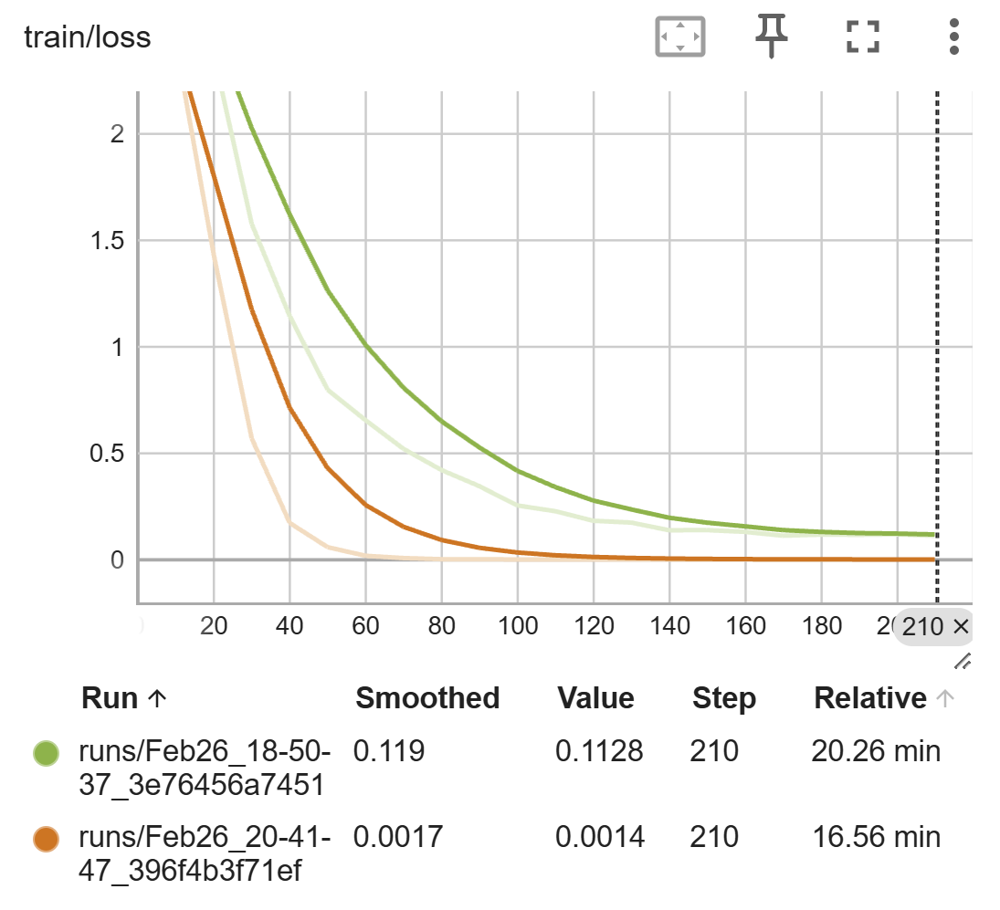

# Project Plan

## Current State / Direction

There are three areas to improve for the model

1. Performance (wall clock time)
2. Model Stability
3. Model Training

On top of that, We also need to run the benchmarking code to track the actual progress the model is making. We will aim to run the following benchmarks

* Polymath
* AIME24

## Next Steps

- [ ] Check if there is some bug that is causing the model in absence of attention mask to not produce the eos token.
- [ ] Check if there is a bug in presence of attention mask that causes the cot to be malformed.
- [ ] Explore the use of flash attention to speed up inference
- [ ] Explore the use of Gemini to generate the dataset since we have some credits available. Claude Opus-4.6 is turning out to be too expensive.
- [ ] Explore some papers on Schema enforcement for models to see if there are some loss methods to train the model to produce better cot structure.
- [ ] Implement and pass a `NoteTaker` to the `generate` method so instead of discarding, we can save the pruned traces for debugging purposes.
- [ ] Train a new model with eval to find the overfitting behaviour if present.

## Changelog

### 2026-02-26

#### State
Positive:
* Overfit the training data
* The model can now produce hierarchical chain of thought

Negative:
* The model still gets stuck on generating tokens until it runs out of max tokens even though it has arrived at the solution. Surprisingly, this only happens when there is not meaningful masking being applied as part of generate. The model consistenly terminates when the window for attention_masking is sufficiently large.
* The generated thought-solution-return pairs seem off in presence of attention_mask during inference.

#### Bugfix

* Fixed the masking and pruning logic to retain the [THOUGHT] token. Earlier the logic, due to offset error, was pruning the [THOUGHT] token and retaining the [SOLUTION] token.

* Remove `packing=True` from the Training Arguments. As per documentation, using packing without flash attention can lead to instability

#### Experiments

* **Seed special tokens with embedding for tokens that are closest in meaning**

  Since we have very small datasize, we hypothesize that the model is unable to train the tokenizer and draw patterns in the short window of training. Seeding the special tokens with closest meaning will perhaps have a better chance of allowing the model to learn the meaning of the tokens which should speed up the training.

  While the actual implementation is in [train.ipynb](https://github.com/anujjamwal/cognitive-compression/blob/milestone-submission/lib/train.ipynb), basically we use the following map to seed the data

  ```python
    seed_map = {
        "[THOUGHT]":  "subproblem start",
        "[SOLUTION]": "summary of solution",
        "[RETURN]":   "subproblem return",
        "<think>":    "thinking start",
        "</think>":   "thinking complete",
    }
  ```

* **Replace built-in `compute_loss` method in `SFTTrainer` class with custom implementation**
  
  The default implementation doesn't work because we need to regenerate the attention_mask into a 4d structure. The default implementation expects a 2d structure. 

#### Outcome

* The model now trains much faster and is more stable in terms of its output. However, it does seem to be overfitting and we have too many epochs.

  

* The model works when there is a meaningfully long min_token length passed to allow for attention_mask to be  used but becomes unstable otherwise.

    |Generation|Min Tokens|Max Tokens|Wall Time (s)|Generated Tokens|Output Tokens|
    |-|-|-|-|-|-|
    |Baseline | ~ | 4096 | 114.73 | 3294 | 3408 |
    |HCot (Repetition)* | 0 | 4096 |386.29 | 9568 (6300) | 4206 (990) |
    |HCot | 1024 | 4096 | <span style="color: red;">680.60</span> | <span style="color: red;">17045</span> | <span style="color: green;">993</span> |
    |HCot | 2048 | 4096 | 235.09 | 4746 | <span style="color: green;">1947</span> |
    |HCot (Wrong) | 4097 | 4096 | 255.79 | 4096 | 4206 |

### 2026-02-25

#### State
Positive:

* Generate method now is optimized to use more vector operations
* Generate now also produces statistics like prune events, total tokens generated, total pruned tokens etc.

Negative:

* The model is very unstable. The produced Cot are misaligned, wrong and the model gets stuck in loop.

#### Bugfix

#### Experiments

* **Optimize the inference loop**
  - Replaced recomputation of cot tokens on each run with inline tracking which reduced the cost from O(n^2) to O(n).
  - Updated the operations in the loop to utilize vector operations rather than imperative operations.

#### Outcome

* The generate loop is slightly better in performance

### Template Add Date

#### State
Positive:

Negative:

#### Bugfix

#### Experiments

#### Outcome